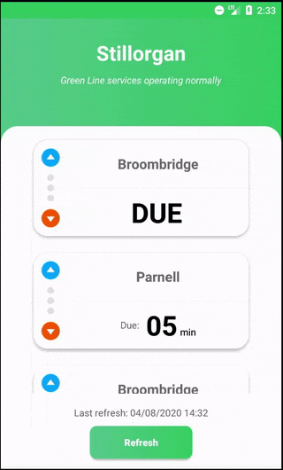

# LUAS App Sample

An application that shows the LUAS trams forecast:
- at 00:00 to 12:00 from Marlborough LUAS stop towards Outbound;
- at 12:01 to 23:59 from Stillorgan LUAS stop towards Inbound.

The app was built using:
- Programming Language: [Kotlin](https://kotlinlang.org)
- Architecture: [MVVM](https://developer.android.com/jetpack/guide)
- Dependency injection: [Hilt](https://dagger.dev/hilt/)
- HTTP Client: [Retrofit](https://github.com/square/retrofit) with [SimpleXmlConverter](https://github.com/square/retrofit/tree/master/retrofit-converters/simplexml)
- Mocking library: [Mockk](https://mockk.io)
